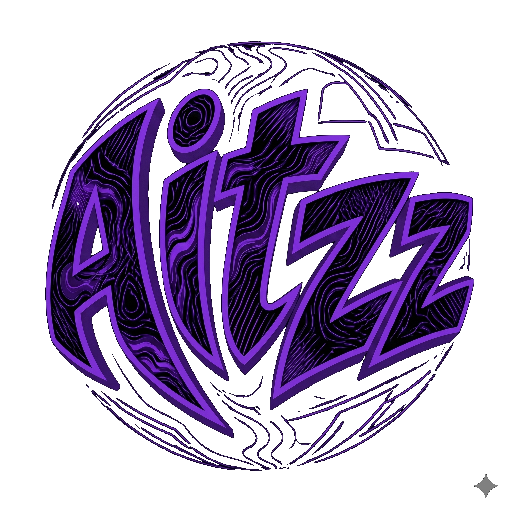

# Sistema Gestor Financiero **Exclusive: Optimal Financial Decisions**

Exclusive es una solución integral de gestión financiera diseñada bajo una arquitectura de sincronización diferida (Offline-First). El ecosistema se compone de una aplicación móvil para la gestión operativa y una aplicación de escritorio nativa para Windows que actúa como nodo central (Host). El sistema prioriza la soberanía de los datos, utilizando el equipo personal del usuario como servidor de base de datos privado.

## Características Principales

* **Arquitectura de Sincronización Diferida:** Permite la gestión completa de transacciones sin conexión activa, sincronizando deltas de datos automáticamente al detectar el host en la red local.
* **Host Nativo con Integración en System Tray:** Aplicación de escritorio que gestiona el ciclo de vida del servidor desde la bandeja de sistema, minimizando el impacto en los recursos del sistema operativo.
* **Descubrimiento ZeroConf:** Implementación del protocolo mDNS para la vinculación automatizada entre dispositivos móviles y el host sin necesidad de configuración de direcciones IP estáticas.
* **Gestión Multiusuario Segura:** Soporte para múltiples perfiles concurrentes con aislamiento lógico de datos y encriptación en reposo.

## Stack Tecnológico

* **Frontend (Móvil y Escritorio):** Flutter utilizando Riverpod para la gestión de estado reactiva.
* **Persistencia Local:** Isar Database para almacenamiento NoSQL de alto rendimiento en dispositivos finales.
* **Capa de Servicio (Backend):** Fastify con TypeScript ejecutado en contenedores Docker.
* **Persistencia Central:** PostgreSQL bajo arquitectura relacional para garantizar integridad ACID.
* **Infraestructura:** Docker Compose para la orquestación de servicios y contenedores ligeros basados en Alpine Linux.

## Enfoque en Seguridad y Calidad de Software

El proyecto se fundamenta en principios de ciberseguridad aplicada y buenas prácticas de ingeniería:
1. **Autenticación Robusta:** Implementación de Hashing de contraseñas mediante Argon2id y gestión de sesiones mediante JSON Web Tokens (JWT).
2. **Validación de Datos:** Uso de esquemas Zod para la sanitización de entradas y prevención de ataques de inyección.
3. **Comunicación Segura:** Handshake de emparejamiento inicial basado en códigos de un solo uso (OTP) para establecer confianza entre el móvil y el host.
4. **Optimización de Recursos:** Gestión de procesos en segundo plano diseñada para mantener un bajo consumo de CPU y memoria RAM en el host.

---
# **Desarrollado por Vicente Pavez (Aitzz)**

 