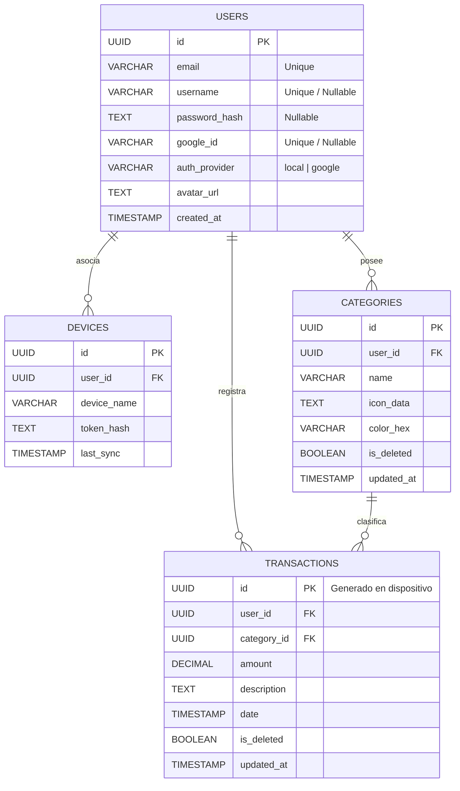

```typescript
/*
 * Copyright (c) 2026 Vicente Pavez (Aitzz)
 * Licensed under the MIT License.
 */
```
# Diagrama ER — Modelo de Base de Datos

Este archivo contiene un diagrama ER en formato Mermaid pensado para documentación profesional. Incluye las entidades principales, sus campos y relaciones.

## Notas

- Tipos mostrados son orientativos y siguen la nomenclatura definida en el modelo.
- `transactions.id` se genera en el dispositivo móvil.
- `updated_at` se usa para resolución de conflictos durante sincronización.



## Leyenda

- PK: Primary Key
- FK: Foreign Key
- Tipos: `UUID`, `VARCHAR`, `TEXT`, `DECIMAL`, `TIMESTAMP`, `BOOLEAN`

---
